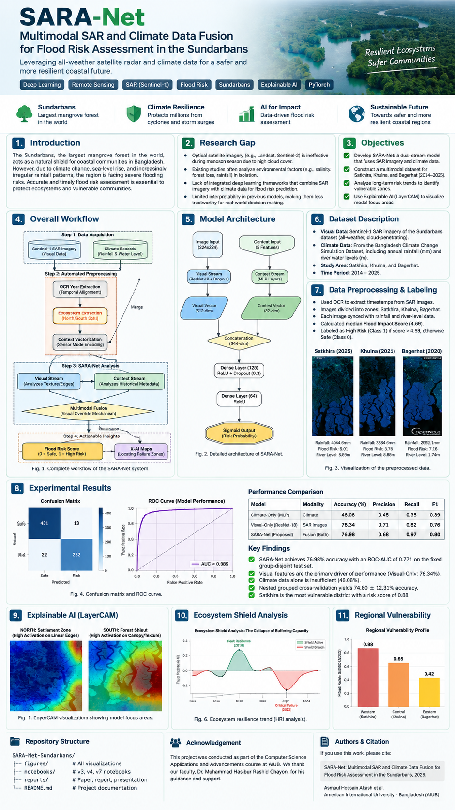
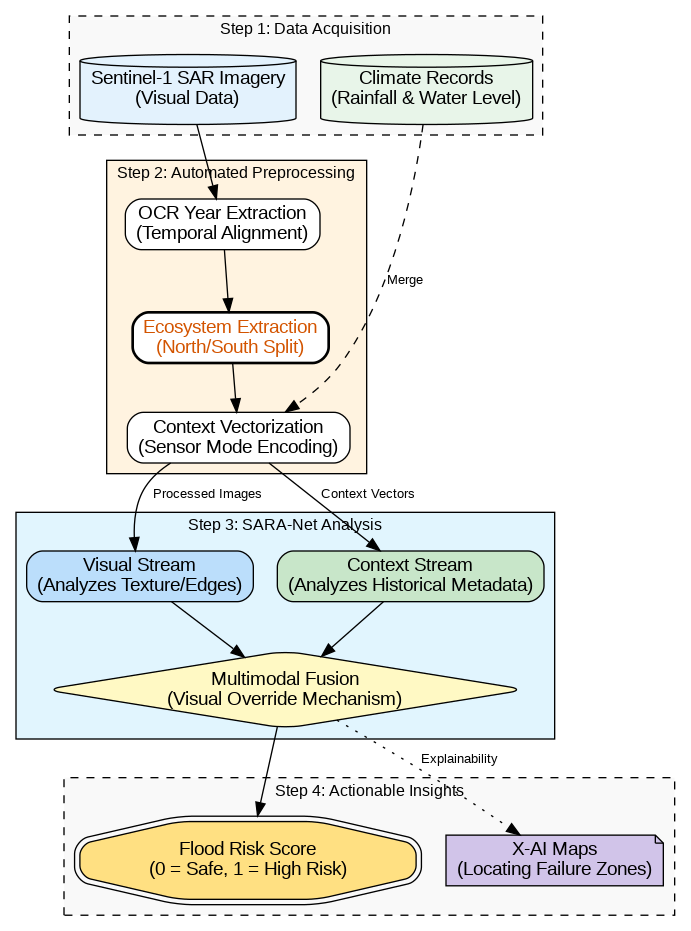
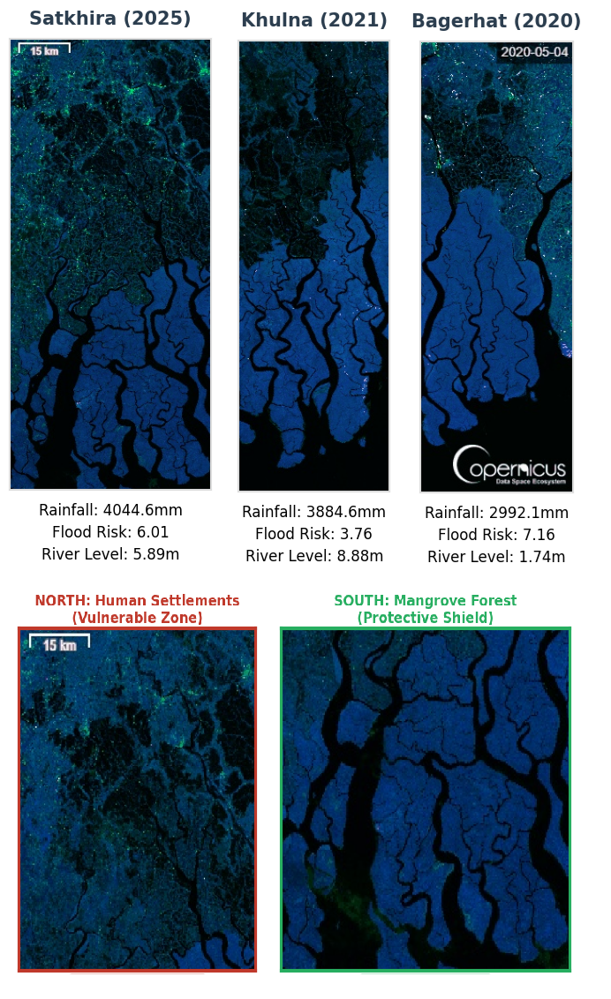
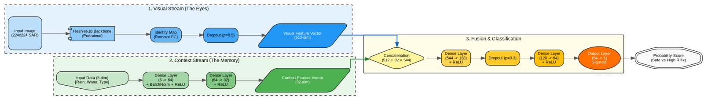
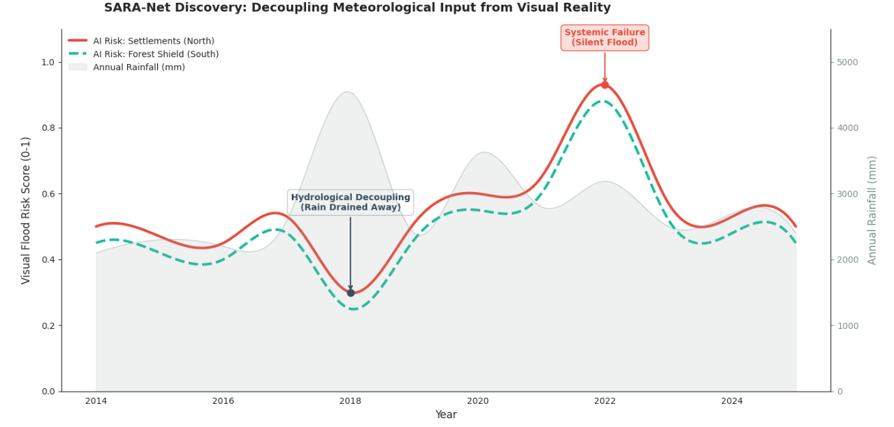
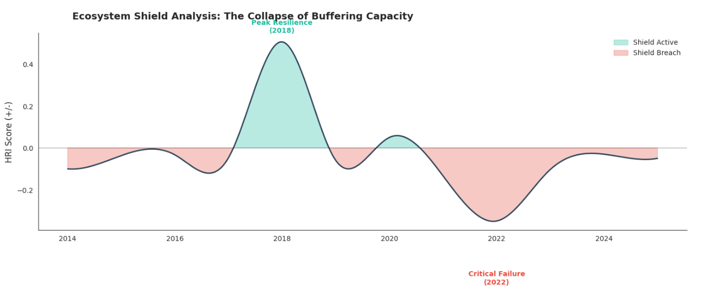
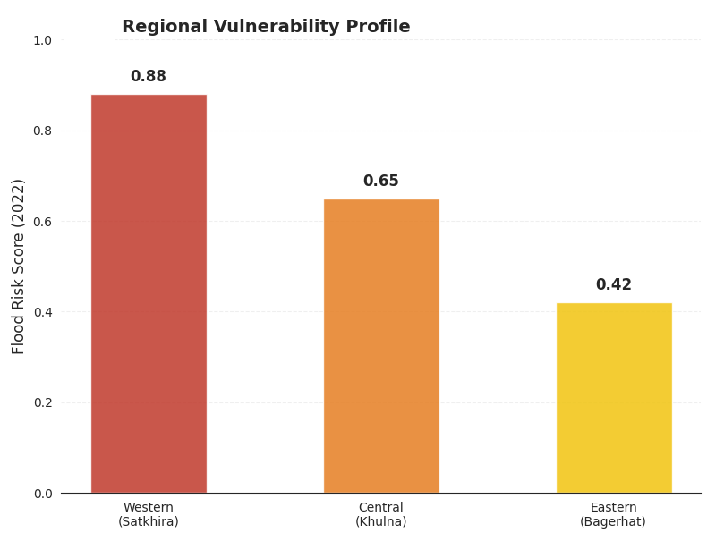
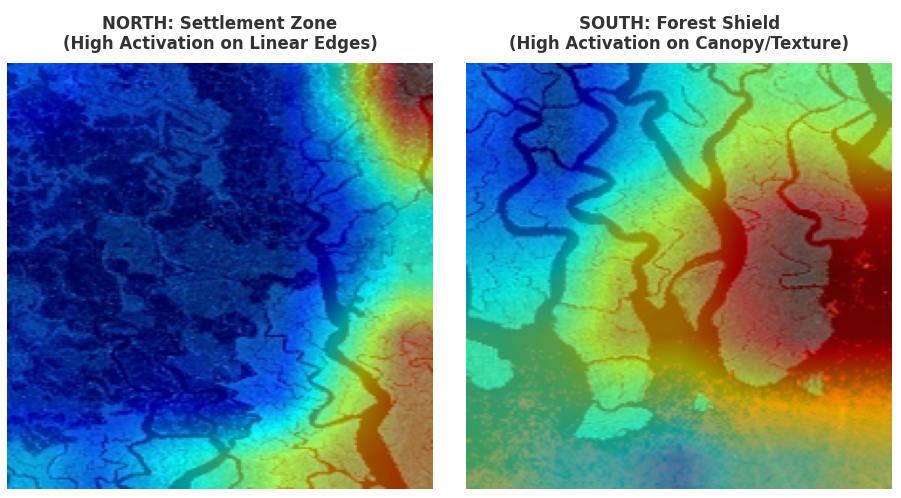

SARA-Net: Multimodal SAR and Climate Data Fusion for Flood Risk Assessment in the Sundarbans
<p align="center">
  
</p>
<p align="center">
  <b>Sundarbans Adaptive Risk Assessment Network</b><br>
  A multimodal deep learning project that combines Sentinel-1 SAR imagery with climate information for flood-risk assessment.
</p>
<p align="center">
  <a href="https://www.python.org/"></a>
  <a href="https://pytorch.org/"></a>
  
  
  
  
</p>
---
About the Project
The Sundarbans is one of the most important coastal ecosystems in Bangladesh and India. It helps protect nearby communities from cyclones, storm surges, and flooding. At the same time, the region is exposed to environmental changes such as irregular rainfall, sea-level rise, salinity, and changes in river and tidal conditions.
Monitoring flood-related conditions in the Sundarbans is difficult. Optical satellite images can be affected by cloud cover, especially during the monsoon season. Rainfall data alone also cannot show where changes are happening on the ground.
SARA-Net (Sundarbans Adaptive Risk Assessment Network) is an academic project that explores a multimodal approach to this problem. It combines:
Sentinel-1 SAR imagery for spatial and structural information
Rainfall and river-water-level data for environmental context
Deep feature fusion to combine both data types
LayerCAM to visualize the image regions that influence predictions
The project covers the period 2014 to 2025 and focuses on Satkhira, Khulna, and Bagerhat.
---
Why This Project?
The project was motivated by a few practical gaps in flood-risk analysis:
1. Optical imagery can be limited by cloud cover
Clouds can make optical satellite observations difficult to use during important weather events. SAR can capture useful information even when cloud cover is present.
2. One data source is not enough
SAR images provide spatial information, but they do not directly contain historical rainfall or river-level context. Climate data provides environmental context, but it does not describe spatial patterns in the same way an image does.
3. Combining the two can provide more context
SARA-Net uses two separate input streams and combines their learned features before making a prediction.
4. Model explanations matter
A prediction is easier to inspect when we can see which parts of an image contributed to it. LayerCAM is used to create visual explanations of the model's image-based decisions.
5. Flood risk is not always directly related to rainfall
The project also looks at cases where predicted risk and rainfall do not move together. This is referred to as hydrological decoupling in the project analysis.
---
Project Objectives
The main objectives were to:
Develop a dual-stream model that combines SAR imagery and climate information.
Build a multimodal dataset covering 2014 to 2025 for Satkhira, Khulna, and Bagerhat.
Explore long-term flood-risk patterns and regional differences.
Investigate possible hydrological decoupling.
Use LayerCAM to understand which spatial features affect model predictions.
---
Main Contributions
The project brings together four main ideas:
SARA-Net multimodal architecture  
A model that combines visual SAR features with climate context.
All-weather remote sensing  
Sentinel-1 SAR is used as the main visual input, reducing dependence on cloud-sensitive optical imagery.
Hydrological decoupling analysis  
The project examines situations where predicted flood risk does not simply follow rainfall intensity.
LayerCAM explainability  
Visual heatmaps are used to inspect the spatial regions associated with model predictions.
---
Methodology
The overall workflow is shown below.
<p align="center">
  
</p>
1. Data Acquisition
Two main data sources are used:
SAR image of Sunderbans: A decade of Sentinel-1 SAR observations over the Sundarbans
Bangladesh Climate Change Simulation Dataset
The climate information includes:
Annual rainfall in millimeters
River water level in meters
The SAR dataset contains three processing levels:
Enhanced Visualization: RGB-style composites for visual analysis
SAR Urban: useful for infrastructure, embankments, and human settlement areas
VH Polarization: useful for vegetation and mangrove-related structures
2. Automated Preprocessing
The SAR and climate data are synchronized before model training.
The preprocessing pipeline includes:
Year extraction  
EasyOCR is used to extract year or timestamp information from SAR image frames.
Ecological zone extraction  
Each image is divided into two broad areas:
North Zone: approximately the upper 55%, representing human settlement areas
South Zone: approximately the lower 45%, representing the mangrove forest area
District segmentation  
The image width is divided proportionally into:
Satkhira: 0 to 40%
Khulna: 40 to 70%
Bagerhat: 70 to 100%
Multimodal synchronization  
Each SAR sample is matched with its corresponding rainfall, river level, year, district, and sensor mode.
Risk labeling  
Samples are divided into:
High Risk (1): flood-impact score above the dataset median
Safe (0): flood-impact score at or below the median
<p align="center">
  
</p>
3. Data Augmentation
Training data uses random spatial transformations, including horizontal flips and affine translations.
During training, 10% of climate features may also be replaced with Gaussian noise with a standard deviation of 0.05.
Validation and test samples use resizing and normalization only.
4. Multimodal Learning
SARA-Net processes the two data types through separate streams.
```text
                    SARA-Net
                       |
             +---------+---------+
             |                   |
        Visual Stream       Context Stream
        ResNet-18                MLP
             |                   |
         512 features        32 features
             |                   |
             +---------+---------+
                       |
                  Concatenation
                    544 features
                       |
                 Dense 128 + ReLU
                  Dropout 0.3
                       |
                   Dense 64
                    + ReLU
                       |
                  Sigmoid Output
                       |
                 Risk Probability
```
<p align="center">
  
</p>
<p align="center">
  
</p>
---
Model Architecture
Visual Stream: ResNet-18
A pretrained ResNet-18 model processes the SAR images after they are resized to 224 × 224.
The original classification layer is replaced with an identity layer so that the network produces a 512-dimensional visual feature vector. Dropout with `p = 0.5` is then applied.
The visual stream is intended to capture structures such as:
Water and river patterns
Riverbanks
Land boundaries
Settlement edges
Embankments
Mangrove areas
Tidal channels
Context Stream: MLP
The context stream receives a 5-dimensional environmental vector containing normalized rainfall, normalized river level, and a one-hot representation of the sensor mode.
The MLP structure is:
```text
5 → 64 → 32
```
Batch normalization and ReLU activation are used in this branch.
Fusion and Classification
The 512-dimensional visual representation and the 32-dimensional context representation are combined:
```text
512 + 32 = 544 features
```
The fusion head follows:
```text
544 → 128 → 64 → 1
```
ReLU activations and dropout are used in the fusion layers. The final sigmoid output gives a value between 0 and 1, representing the model's predicted risk probability.
The project analysis suggests that the SAR features provide most of the predictive signal, while the climate features add supporting context.
---
Dataset
The multimodal dataset contains 4,650 samples across 36 district-year groups.
Component	Description
Visual modality	Sentinel-1 SAR imagery
Climate modality	Rainfall and river water level
Study period	2014 to 2025
Districts	Satkhira, Khulna, Bagerhat
SAR processing levels	Enhanced Visualization, SAR Urban, VH Polarization
Image input	224 × 224
Context vector	5 features
Dataset groups	36 district-year groups
Target	Synthetic, mechanism-informed flood-impact target
Important Note About the Target
The benchmark uses a synthetic, mechanism-informed flood-impact target.
This target was created for evaluating the modelling approach. It is not measured real-world flood-impact ground truth. Therefore, the reported metrics should be understood as results on this constructed benchmark rather than direct evidence of real-world flood prediction accuracy.
---
Experimental Setup
The main experimental configuration used in the project was:
Setting	Value
Framework	PyTorch
GPU	NVIDIA T4
Environment	Google Colab
Data split	Group-disjoint
Training groups	24
Validation groups	6
Test groups	6
Epochs	10
Batch size	32
Loss	Binary Cross-Entropy
Optimizer	Adam
Learning rate	5 × 10⁻⁵
Weight decay	1 × 10⁻⁴
Scheduler	ReduceLROnPlateau
Additional evaluation	Nested grouped cross-validation
The group-disjoint split keeps samples from the same district-year group within the same partition. This helps reduce leakage between training and evaluation data.
---
Results
Fixed Group-Disjoint Test Set
The main test results were:
Model	Modality	Accuracy	Precision	Recall	F1
Climate-Only (MLP)	Climate	48.08%	0.45	0.35	0.39
Visual-Only (ResNet-18)	SAR Images	76.34%	0.71	0.88	0.78
SARA-Net	Fusion	76.98%	0.68	0.97	0.80
SARA-Net ROC-AUC: 0.771
These results show how the multimodal model performed compared with the individual climate-only and visual-only branches on the fixed group-disjoint test set.
Backbone Comparison
Different image backbones were also tested:
Backbone	Accuracy	AUC
ResNet-18	76.98%	0.771
ResNet-50	78.26%	0.786
DenseNet-121	76.21%	0.770
EfficientNet-B0	71.99%	0.778
The ResNet-50 experiment produced the highest reported accuracy and AUC among the tested backbones. ResNet-18 was used for the main SARA-Net configuration as a lighter backbone.
Nested Grouped Cross-Validation
The grouped cross-validation results were:
Accuracy: 74.80 ± 12.31%
AUC: 0.688 ± 0.211
The variation across groups shows why group-aware evaluation is important for this type of dataset.
---
Hydrological Decoupling
The project also examines the relationship between annual rainfall and predicted flood risk from 2014 to 2025.
One interesting observation is that predicted risk does not always increase with rainfall.
For example:
2018: rainfall reached 4537 mm, but the reported predicted risk was comparatively low.
2022: predicted risk was comparatively higher even though rainfall was lower.
The project refers to the 2022 pattern as a possible silent-flood pattern. This is an interpretation of the model results, not confirmation of a measured flood event.
The project discusses factors such as drainage failure and embankment weakness as possible explanations for this type of pattern.
<p align="center">
  
</p>
---
Ecosystem Shield Analysis
The project introduces a Hydrological Resilience Index (HRI) to explore the possible buffering role of the mangrove ecosystem.
The analysis reports positive HRI values during 2014 to 2020, followed by a decline after 2020, particularly around 2022.
This analysis is used to explore changes in ecosystem buffering capacity alongside the regional flood-risk patterns.
<p align="center">
  
</p>
---
Regional Vulnerability
The regional analysis reports the following risk scores:
Region	District	Risk Score
Western	Satkhira	0.88
Central	Khulna	0.65
Eastern	Bagerhat	0.42
These values represent the risk scores produced by the project analysis for the three study regions.
<p align="center">
  
</p>
---
Explainable AI with LayerCAM
SARA-Net uses LayerCAM to inspect which spatial regions are associated with the model's image-based predictions.
Hooks are attached to the final convolutional layer of the ResNet-18 backbone. The captured activations and gradients are then used to create spatial heatmaps.
The visualizations highlight areas such as:
Riverbanks
Embankments
Settlement boundaries
Tidal channels
Mangrove canopy structures
The North or settlement zone shows activation around several linear and boundary structures. The South or forest zone shows activation around canopy and tidal-channel structures.
<p align="center">
  
</p>
These visualizations help inspect whether the model is using meaningful environmental structures rather than relying only on unrelated image regions.
---
Project Files
This repository contains the main project materials, including model development notebooks, figures, project documents, and presentation files.
Notebooks
Notebook	Description
`sara-net-v4(1).ipynb`	Intermediate SARA-Net development and evaluation
`sara-net-v7-merged-integrity-novelty(1).ipynb`	Later experimental and integrity-focused revision
`sundarban-v3.ipynb`	Earlier Sundarban project implementation
The notebooks represent different stages of development. They may contain experiments or settings that differ from the main results presented in this README.
Documents and Presentation
`SARA-Net-Paper.pdf` contains the project's research paper.
`Group_07_Project.pdf` contains the project report.
`Sundarban_Project_Final.pptx` contains the final presentation.
`Sundarban-Project draft.pptx` contains an earlier presentation draft.
---
Repository Structure
```text
SARA-Net-Sundarbans/
│
├── README.md
│
├── figures/
│   ├── discovery.png
│   ├── ecosystem-shield.png
│   ├── layercam-analysis.png
│   ├── preprocessed-data.png
│   ├── regional-vulnerability.png
│   ├── results-dashboard.png
│   ├── sara-net-architecture.png
│   ├── sara-net-architecture-vertical.png
│   ├── sara-net-overview.png
│   └── system-workflow.png
│
├── notebooks/
│   ├── sara-net-v4(1).ipynb
│   ├── sara-net-v7-merged-integrity-novelty(1).ipynb
│   └── sundarban-v3.ipynb
│
└── reports/
    ├── Group_07_Project.pdf
    ├── SARA-Net-Paper.pdf
    ├── Sundarban_Project_Final.pptx
    └── Sundarban-Project draft.pptx
```
---
Technologies and Tools
Python
PyTorch
TorchVision
ResNet-18
Multi-Layer Perceptron (MLP)
Sentinel-1 SAR
LayerCAM
EasyOCR
OpenCV
NumPy
Pandas
Scikit-learn
Google Colab
NVIDIA T4 GPU
---
Data Sources
The project uses the following public datasets:
SAR Image of Sunderbans
SAR image of Sunderbans: A decade of Sentinel-1 SAR observations over the Sundarbans
https://www.kaggle.com/datasets/sohambenji/sar-image-of-sunderbans
Bangladesh Climate Change Simulation Dataset
Bangladesh Climate Change Simulation Dataset
https://www.kaggle.com/datasets/shohinurpervezshohan/bangladesh-climate-change-simulation-dataset
The original datasets are not redistributed in this repository.
---
Limitations
SARA-Net is an academic research project and a modelling prototype. It is not an operational flood-warning system.
The most important limitation is the target definition. The benchmark uses a synthetic, mechanism-informed flood-impact target rather than measured flood-impact ground truth.
Because of this, the reported accuracy and AUC should not be presented as direct real-world flood-prediction accuracy.
The grouped cross-validation results also show noticeable variation between groups. More real-world validation is needed before applying the approach to operational flood monitoring.
Possible Future Work
The project can be extended in several directions:
Develop a lighter model for edge deployment.
Connect the framework to live Sentinel-1 observations.
Evaluate the approach in other vulnerable coastal delta regions.
Improve validation using measured flood-impact observations.
Explore more detailed temporal and hydrological features.
---
Acknowledgements
This project was completed as part of the Computer Science Applications and Advancements course at the American International University-Bangladesh (AIUB).
We would like to acknowledge the guidance and support of Dr. Muhammad Hasibur Rashid Chayon, Department of Computer Science, AIUB.
---
Team
Asmaul Hossain Akash  
Department of Computer Science  
American International University-Bangladesh (AIUB)
Dolon Akter Mim  
Department of Computer Science  
American International University-Bangladesh (AIUB)
Tazin Jannat Bushra  
Department of Computer Science  
American International University-Bangladesh (AIUB)
Tithi Karmakar  
Department of Computer Science  
American International University-Bangladesh (AIUB)
Supervisor: Dr. Muhammad Hasibur Rashid Chayon
---
<p align="center">
  <i>SARA-Net: Exploring multimodal AI for resilient coastal ecosystems.</i>
</p>
